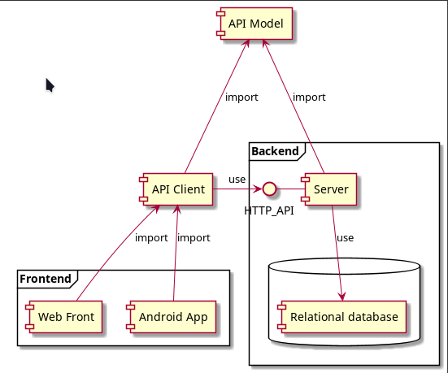

# Обзор архитектуры

## Компонентная модель системы

### Web Front

Пользовательский веб-интерфейс.

#### Стек:
- Язык: TypeScript
- Библиотеки: React, ..(TODO: Next.js?) 

### Android

Мобильное приложения для платформы Android

#### Стек:
- Язык программирования: Kotlin
- Dependency Injection: KOIN
- Дополнительные библиотеки UI компонентов: TODO: Гугл карты 
- Сетевое взаимодействие с сервером: API Client

### API Model

Библиотека cодержит DTO для взаимодействия с АПИ сервера, общие для Системы константы, включая, возможно, коды ошибок.

Язык реализации: Kotlin/Multiplatform.

Имеет только Сommon-Kotlin код, т.е не зависит от конечной платформы использования.

Компилируется под JS и JVM

### API Client

Библиотека для асинхронного взаимодействия с АПИ сервера.

Инкапсулирует сетевые вызовы АПИ и обработку сетевых ошибок.

#### Стек:
- Язык реализации: Kotlin/Multiplatform
- HTTP-клиент: Ktor-client
- Компилируется под платформы JS и JVM для использования в веб- и Android-приложениях соответственно.
- Использует для API Model для десериализации ответов сервера

### Server

Веб-сервер системы.
- предоставляет HTTP REST API
- Содержит реализацию бизнес-логики
- Ваимодействет с базой данных:
    - Версионирование БД
    - Соединение с БД
- взаимодействие с внешними сервисами:
    - почтовый сервер
    - в будущем OAuth сервера авторизации

#### Стек:
- Язык реализации: Kotlin/JVM
- Веб-фреймворк: Spring Boot(Dependency Injection, обработка HTTP запросов)
- Валидация запросов: Konform
- Контроль доступа: Spring Security
- Веб-сервер: Embedded Tomcat
- ORM: JPA + Hibernate
- Версионирование БД: Flyway
- Юнит-тестирование: JUnit 5
- Интеграционное тестирование: SpringBootTest + RestAssured + Posgres 